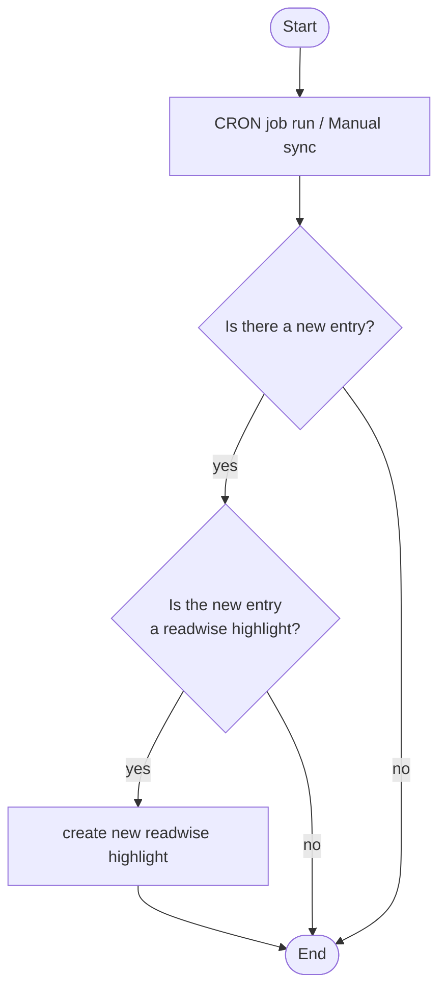

# Flowchart

```mermaid
flowchart TD
    start_node([Start])
    --> periodic_check[CRON job run / Manual sync]
    --> new_entry{Is there a new entry?}

    new_entry -- yes -->
    is_highlight{Is the new entry \n a readwise highlight?}
        -- yes -->

    readwise_flow[create new readwise highlight]
    --> end_node


    is_highlight -- no --> end_node
    new_entry -- no --> end_node([End])
```
